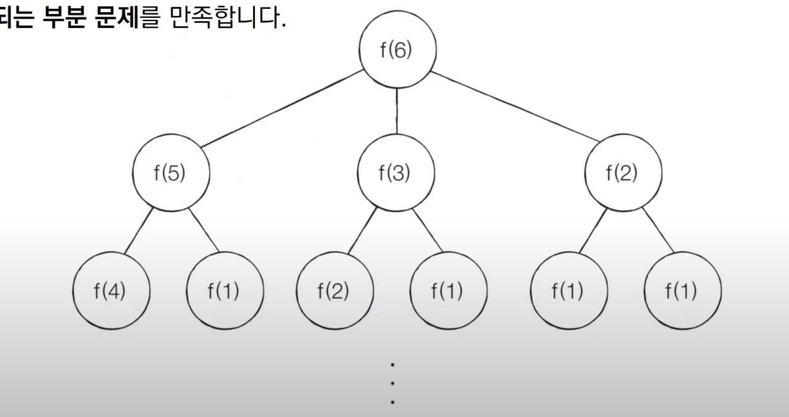

# 문제 : 1로 만들기

- 정수 X가 주어졌을 떄, 정수 X에 사용할 수 있는 연산은 다음과 같이 **4가지**이다.
  1. X가 5로 나누어 떨어지면, 5로 나눈다
  2. X가 3으로 나누어 떨어지면, 3으로 나눈다
  3. X가 2로 나누어 떨어지면, 2로 나눈다
  4. X에서 1을 뺀다.
- 정수 X가 주어졌을 때, 연산 4개를 적절히 사용해서 값을 1로 만들고자 한다. 연산을 사용하는 횟수의 최솟값을 출력해라, 예를 들어 정수가 26이면 다음과 같이 계산해서 3번의 연산이 최솟값이다.
  - 26 -> 25 -> 5 -> 1

## 문제 조건

> 난이도 🔴🔺⚪ | 풀이 시간 `20분` | 시간 제한 `1초` | 메모리 제한 `128MB`
> 입력 조건 :

- 첫째 줄에 정수 X가 주어진다. (1 <= X <= 30,000)

출력 조건:

- 첫째 줄에 연산을 하는 횟수의 최솟값을 출력한다.

- **입력 예시**

> 26

**출력 예시**

> 3

## 문제 해결 아이디어

- 피보나치 수열 문제를 도식화 한 것처럼 함수가 호출되는 과정을 그림으로 그려보면 다음과 같다.
  - 최적 부분 구조와 중복되는 부분 문제를 만족한다.
    

## 답안 예시

**1로만들기.py**

```py
# 정수 X를 입력받기
x = int(input())

# 앞서 계산된 결과를 저장하기 위한 DP 테이블 초기화
d = [0] * 3001

# 다이나믹 프로그래밍 진행(보텀업)
for i in range(2, x + 1):
  # 현재의 수에서 1을 뺴는 경우
  d[i] = d[i - 1] + 1
  # 현재의 수가 2로 나누어 떨어지는 경우
  if i % 2 == 0:
    d[i] = min(d[i], d[i // 2] + 1)
  # 현재의 수가 3으로 나누어 떨어지는 경우
  if i % 3 == 0:
    d[i] = min(d[i], d[i // 3] + 1)
  # 현재의 수가 5로 나누어 떨어지는 경우
  if i % 5 == 0:
    d[i] = min(d[i], d[i // 5] + 1)

print(d[x])

```
