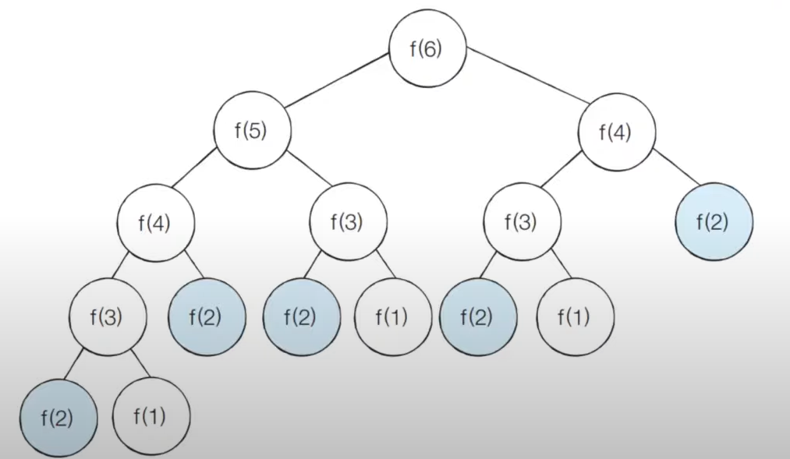

# 다이나믹 프로그래밍

- 다이나믹 프로그래밍은 메모리를 적절히 사용하여 수행 시간 효율성을 비약적으로 향상시키는 방법이다.
- 이미 계산된 결과(작은 문제)는 별도의 메모리 영역에 저장하여 다시 계산하지 않도록 한다.
- 다이나믹 프로그래밍의 구현은 일반적으로 두 가지 방식(탑다운과 바텀업)으로 구성된다.
- 다이나믹 프로그래밍은 **동적 게획법**이라고도 부른다.
- 일반적인 프로그래밍 분야에서의 동적(Dynamic)이란 어떤 의미를 갖는가?

  - 자료구조에서 동적 할당(Dynamic Allocation)은 **프로그램이 실행되는 도중에 실행에 필요한 메모리를 할당하는 기법**을 의미한다.
  - 반면에 `다이나믹 프로그래밍`에서 `다이나믹`은 **별다른 의미 없이 사용된 단어**이다.

- 다이나믹 프로그래밍은 문제가 다음의 조건을 만족할 때 사용할 수 있다.
  1. **최적 부분 구조 (Optimal Substructure)**
     - 큰 문제를 작은 문제로 나눌 수 있으며 작은 문제의 답을 모아서 큰 문제를 해결할 수 있다.
  2. **중복되는 부분 문제 (Overlapping Subproblem)**
     - 동일한 작은 문제를 반복적으로 해결해야 한다.

## 피보나치 수열

- 피보나치 수열은 다음과 같은 형태의 수열이며, 다이나믹 프로그래밍으로 효과적으로 게산 할 수 있다.
  > 1, 1, 2, 3, 5, 8, 13, 21, 34, 55, 89, ...
- **점화식**이란 인접한 항들 사이의 관계식을 의미힌다.
- 피보나치 수열을 점화식으로 표현하면 다음과 같다.
- a<sub>n</sub> = a<sub>n-1</sub> + a<sub>n-2</sub>
- a<sub>1</sub> = 1, a<sub>2</sub> =2
- 피보나치 수열이 계산되는 과정은 다음과 같이 표현 할 수 있다.
  - 프로그래밍에서는 이러한 수열을 배열이나 리스트를 이용해 표현한다.
    
- 피보나치 수열이 계산되는 과정은 다음과 같이 표현할 수 있다.
  - n번째 피보나치 수를 f(n)라고 할 떄 4번째 피보나치 수 f(4)를 구하는 과정은 다음과 같다.
    

**피보나치수열.py**

```py
def fibo(x):
    if x == 1 or x == 2:
        return 1
    fibo(x-1) + fibo(x-2)

print(fibo(4))
```

### 피보나치 수열의 시간 복잡도 분석

- 단순 재귀 함수로 피보나치 수열을 해결하면 지수 시간 복잡도를 가지게 된다.
- 다음과 같이 f(2)가 **여러 번 호출**되는 것을 확인할 수 있다. (중복되는 부분 문제)
  
- 피보나치 수열의 **시간 복잡도**는 다음과 같다.
  - 세타 표기법 : θ(1.618···<sup>N</sup>)
  - 빅오 표기법 : O(2<sup>N</sup>)
- 빅오 표기법을 기준으로 f(30)을 계산하기 위해 약 10억가량의 연산을 수랭해야 한다.
- 그렇다면 f(100)을 계산하기 위해 얼마나 많은 연산을 수행해야 할까?

### 피보나치 수열의 효율적인 해법 : 다이나믹 프로그래밍

- 다이나믹 프로그래밍의 사용 **조건**을 만족하지는 확인한다.
  1. **최적 부분 구조**: 큰 문제를 작은 문제로 나눌 수 있다.
  2. **중복되는 부분 문제**: 동일한 작은 문제를 반복적으로 해결한다.
- 피보나치 수열은 다이나믹 프로그래밍의 사용 조건을 만족한다.

### 메모이제이션 (Memoization)

- 메모이제이션은 다이나믹 프로그래밍을 구현하는 방법 중 하나이다.
- **한 번 계산한 결과를 메모리 공간에 메모**하는 기법이다.
  - 같은 문제를 다시 호출하면 메모했던 결과를 그대로 가져온다.
  - 값을 기록해 놓는다는 점에서 **캐싱(Caching)**이라고도 한다.

### 탑다운 VS 바텀업

- 탑다운(메모이제이션) 방식은 **하향식**이라고도 하며 바텀업 방식은 **상향식**이라고도 한다.
- 다이나믹 프로그래밍의 전형적인 형태는 바텀업 방식이다.
  - 결과 저장용 리스트는 DP 테이블이라고 부른다.
- 엄밀히 말하면 메모이제이션은 **이전에 계산된 결과를 일시적으로 기록해 놓는 넓은 개념을 의미**한다.
  - 따라서 메모이제이션은 다이나믹 프로그래밍에 국한된 개념은 아니다.
  - 한 번 계산된 결과를 담아 놓지만 하고 다이나믹 프로그래밍을 위해 활용하지 않을 수도 있다.

### 피보나치수열 : 탑다운 다이나믹 프로그래밍 소스 코드

**피보나치수열\_탑다운.py**

```py
# 한 번 계산된 결과를 메모이제이션(Memoization)하기 위한 리스트 초기화
d = [0] * 100

# 피보나치 함수(Finonacci Function)를 재귀함수로 구현(탑다운 다이나믹 프로그래밍)
def fibo(x):
    # 종료 조건(1 혹은 2일떄 1을 반환)
    if x == 1 or x == 2:
        return 1
    # 이미 계산한 적 있는 문제라면 그대로 반환
    if d[x] != 0:
        return d[x]
    d[x] = fibo(x - 1) + fibo(x - 2)
    return d[x]

fibo(99)
```

**피보나치수열\_바텀업.py**

```py
# 앞서 계산된 결과를 저장하기 위한 DP 테이블 초기화
d = [0] * 100

# 첫 번째 피보나치 수와 두 번쨰 피보나치 수는 1
d[1] = 1
d[2] = 1
n = 99

# 피보나치 함수(Fibonacci function) 반복문으로 구현(바텀업 다이나믹 프로그래밍)
for i in range(3, n+1):
    d[i] = d[i-1] + d[i-2]

print(d[n])

```

### 피보나치 수열 : 메모이제이션 동작 분석

- 메모이제이션을 이용하는 경우 피보나치 수열 함수의 시간 복잡도는 O(N)이다.

## 다이나믹 프로그래밍 VS 분할 정복

- 다이나믹 프로그래밍과 분할 정복은 모두 최적 부분 구조를 가질 떄 사용할 수 있다.
  - 큰 문제를 작은 문제로 나눌 수 있으며, 작은 문제의 답을 모아서 큰 문제를 해결할 수 이쓴ㄴ 상황
- 다이나믹 프로그래밍과 분할 정복의 차이점은 `부분 문제의 중복`이다.
  - 다이나믹 프로그래밍 문제에서는 각 부분 문제들이 서로 영향을 미치며 부분 문제가 중복된다.
  - 분할 정복 문제에서는 동일한 부분 문제가 반복적으로 계산되지 않는다.
- **분할 정복**의 대표적인 예시인 퀵 정렬을 살펴보자
  - 한번 기준원소(Pivot)가 자리를 변경해서 자리를 잡으면 그 기준 원소의 위치는 바뀌지 않는다.
  - 분할 이후에 해당 피벗을 다시 처리하는 부분 문제는 호출하지 않는다.
    

## 다이나믹 프로그래밍 문제에 접근하는 방법
- 주어진 문제가 다이나믹 프로그래밍 유형임을 파악하는 것이 중요하다.
- 가장 먼저 그리디, 구현, 완전 탐색 등의 아이디어로 문제를 해결할 수 있는지 검토할 수 있다.
  - 다른 알고리즘으로 풀이 방법이 떠오르지 않으면 다이나믹 프로그래밍을 고려해보자.
- 일단 재귀 함수로 비효율적인 완전 탐색 프로그램을 작성한 뒤(탑다운) 작은 문제에서 구한 답이 큰 문제에서 그대로 사용될 수 있으면, 코드를 개선하는 방법을 사용할 수 있다.
- **일반적인 코딩 테스트 수준에서는 기본 유형의 다이나믹 프로그래밍 문제가 출제**되는 경우가 많다.